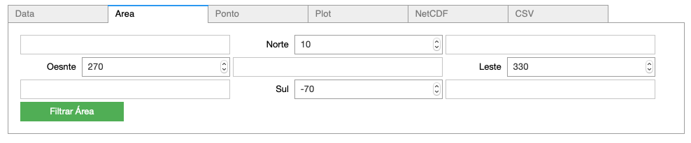

Exemplo Example_lib
===================

Instalar biblioteca 

.. code-block:: console
  pip install jupyter

Este exemplo demonstra varios usos da biblioteca, tais como:

- recuoeracao de dados com filtros (data, variaveis, niveis e step) 
- filtro de area
- plotar campo
- salvar NetCDF

|pic1| - |pic2| - |pic3|

   

   
Download :download:`Example_lib.ipynb <examples/Example_lib.ipynb>`.

