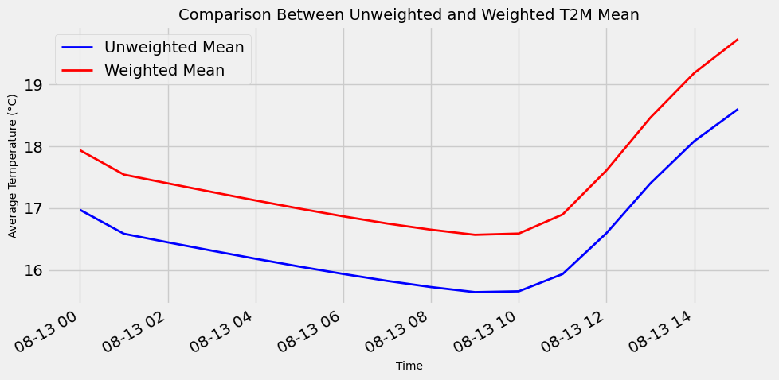

Exemplos Jupyter Notebook
=========================

Instalar biblioteca 

.. code-block:: console

  pip install jupyter

.. warning::
  Alterar a data para os valores exibidos na inicialização
  
.. note::

  **Definição de Steps**
  
  steps = **<int>**
  
  Define o número de steps que serão pedidos
  
  Ex. steps = ``6``
  
  O pedido será os steps ``0,1,2,3,4,5,6``
  
  steps = **<list>**
  
  Define os steps que serão pedidos
  
  Ex. steps =  ``[0,2,4,6]``
  
  O pedido será os steps específicos pedidos ``0,2,4,6``
  
Example_lib
-----------

Este exemplo demonstra varios usos da biblioteca, tais como:

- recuoeracao de dados com filtros (data, variaveis, niveis e step) 
- filtro de area
- plotar campo
- salvar NetCDF


|pic11| - |pic12| - |pic13|

.. |pic11| image:: _static/ex_1_1.png
   :width: 30%

.. |pic12| image:: _static/ex_1_2.png
   :width: 30%
   
.. |pic13| image:: _static/ex_1_3.png
   :width: 30%
   
Download :download:`Example_lib.ipynb <examples/Example_lib.ipynb>`.


Example_lib_regrid
------------------

Utilização da biblioteca UTIL para realizar o Regrid para colocar os modelos na mesma grade.

|pic21| - |pic22| 

.. |pic21| image:: _static/ex_2_1.png
   :width: 45%

.. |pic22| image:: _static/ex_2_2.png
   :width: 45%


Download :download:`Example_lib_regrid.ipynb <examples/Example_lib_regrid.ipynb>`.


Example_lib_Widgets
-------------------

Utilizando Widgets para o desenvolvimento de uma Interface para:
- recuperação de dados
- filtagem de área ou ponto
- plotagem de área ou ponto
- exportar em NetCDF ou CSV

**Janela de Recuperação de Dados**

.. note::

  Escolher data, campo/campos, nível/nîveis e o número de steps do Modelo Numérico.

.. warning::

  O maior número de escolhas afeta o tempo de espera do pedido.
  
  
.. image:: _static/pedido.png
   :width: 70%


**Janela filtro Área**

|pic31| - |pic32| 

.. |pic31| image:: _static/ex_3_1.png
   :width: 45%

.. |pic32| image:: _static/ex_3_2.png
   :width: 45%


**Janela filtro Ponto**

|pic33| - |pic34| 

.. |pic33| image:: _static/ex_3_3.png
   :width: 45%

.. |pic34| image:: _static/ex_3_4.png
   :width: 45%

**Janela Plot**

|pic35| - |pic36| 

.. |pic35| image:: _static/ex_3_5.png
   :width: 45%

.. |pic36| image:: _static/ex_3_6.png
   :width: 45%

**Export NetCDF/CSV**

|pic37| - |pic38| 

.. |pic37| image:: _static/ex_3_7.png
   :width: 45%

.. |pic38| image:: _static/ex_3_8.png
   :width: 45%

.. note::

  O arquivo NetCDF ou CSV é gerado no diretório corrente do .ipynb com o nome de output

Download :download:`Example_lib_Widgets.ipynb <examples/Example_lib_Widgets.ipynb>`.


Example_lib_Stats
-----------------

```python
# Import the ETA model module from the cptecmodel package
import cptecmodel.CPTEC_ETA as ETA
# Import the statistics module from the cptecmodel package
import cptecmodel.Stats as st
# Import matplotlib's predefined style system
import matplotlib.style as style
# Import the main plotting interface from matplotlib
import matplotlib.pyplot as plt
# Import a locator to control the number of ticks on the X-axis
from matplotlib.ticker import MaxNLocator
# Import date formatting tools for the X-axis
import matplotlib.dates as mdates
# Import NumPy for numerical operations
import numpy as np
```


```python
# Instantiate the ETA model
eta = ETA.model()

# Load model data with 15 forecast steps
f = eta.load(steps=15)

```

    
    #### Regional (ams_08km) #####
    
    Forecast data available for reading between 20250803 and 20250813.
    
    Forecast data available for reading between 20250803 and 20250813.
    
    Surface variables: ['u10m', 'v10m', 't2m', 'slp', 'psfc', 'pw', 'precip', 'tsoil', 'soilm', 'tmax', 'tmin', 'dpt', 'acpcp', 'ncpcp', 'asnow', 'lhtfl', 'shtfl', 'gflux', 'ssrun', 'dswrf', 'dlwrf', 'uswrf', 'ulwrf', 'nswrt', 'nlwrt', 'lcdc', 'mcdc', 'hcdc', 'soilw'].
    
    Level variables:   ['t', 'u', 'v', 'rh', 'g', 'omega', 'spfh', 'epot', 'cwat', 'cice'].
    
    levels (hPa): ['1020', '1000', '950', '925', '900', '850', '800', '750', '700', '650', '600', '550', '500', '450', '400', '350', '300', '250', '200', '150', '100', '50'].
    
    Frequency: hourly frequency [0,1,2,...,22,23].
    


### Stats Module

The module computes data using both standard and weighted approaches.

**Weighted Approach** – In the weighted calculation, the area of each grid cell decreases toward the poles. For this type of grid, the cosine of latitude can be used as a proxy for the grid cell area.


### Why use cosine of latitude?

On a regular lat-lon grid:

The **longitudinal spacing** is constant.

But the **area** of each grid cell decreases toward the poles.

The correct weighting factor is proportional to cos(latitude) — because the surface area of a spherical segment is scaled by that.

### Weighted Form


```python
# Calculate unweighted statistics for the variable 't2m' (temperature at 2 meters)
dfWeighted = st.StatsWeighted(f, 't2m').calculate()
dfWeighted
```

<div>
<style scoped>
    .dataframe tbody tr th:only-of-type {
        vertical-align: middle;
    }

    .dataframe tbody tr th {
        vertical-align: top;
    }

    .dataframe thead th {
        text-align: right;
    }
</style>
<table border="1" class="dataframe">
  <thead>
    <tr style="text-align: right;">
      <th></th>
      <th>date</th>
      <th>count</th>
      <th>mean</th>
      <th>min</th>
      <th>max</th>
    </tr>
  </thead>
  <tbody>
    <tr>
      <th>0</th>
      <td>2025-08-13 00:00:00</td>
      <td>814625.0</td>
      <td>17.937557</td>
      <td>-10.671051</td>
      <td>31.094574</td>
    </tr>
    <tr>
      <th>1</th>
      <td>2025-08-13 01:00:00</td>
      <td>814625.0</td>
      <td>17.543119</td>
      <td>-12.684235</td>
      <td>29.018890</td>
    </tr>
    <tr>
      <th>2</th>
      <td>2025-08-13 02:00:00</td>
      <td>814625.0</td>
      <td>17.401203</td>
      <td>-12.988037</td>
      <td>28.949463</td>
    </tr>
    <tr>
      <th>3</th>
      <td>2025-08-13 03:00:00</td>
      <td>814625.0</td>
      <td>17.262048</td>
      <td>-13.338043</td>
      <td>28.255707</td>
    </tr>
    <tr>
      <th>4</th>
      <td>2025-08-13 04:00:00</td>
      <td>814625.0</td>
      <td>17.125095</td>
      <td>-13.811646</td>
      <td>28.266479</td>
    </tr>
    <tr>
      <th>5</th>
      <td>2025-08-13 05:00:00</td>
      <td>814625.0</td>
      <td>16.992873</td>
      <td>-13.928589</td>
      <td>27.962036</td>
    </tr>
    <tr>
      <th>6</th>
      <td>2025-08-13 06:00:00</td>
      <td>814625.0</td>
      <td>16.867119</td>
      <td>-14.138977</td>
      <td>27.876648</td>
    </tr>
    <tr>
      <th>7</th>
      <td>2025-08-13 07:00:00</td>
      <td>814625.0</td>
      <td>16.751793</td>
      <td>-14.370514</td>
      <td>27.926361</td>
    </tr>
    <tr>
      <th>8</th>
      <td>2025-08-13 08:00:00</td>
      <td>814625.0</td>
      <td>16.651263</td>
      <td>-14.559784</td>
      <td>28.127716</td>
    </tr>
    <tr>
      <th>9</th>
      <td>2025-08-13 09:00:00</td>
      <td>814625.0</td>
      <td>16.568375</td>
      <td>-14.727722</td>
      <td>28.209778</td>
    </tr>
    <tr>
      <th>10</th>
      <td>2025-08-13 10:00:00</td>
      <td>814625.0</td>
      <td>16.588756</td>
      <td>-14.962891</td>
      <td>28.333984</td>
    </tr>
    <tr>
      <th>11</th>
      <td>2025-08-13 11:00:00</td>
      <td>814625.0</td>
      <td>16.897881</td>
      <td>-15.125641</td>
      <td>28.468109</td>
    </tr>
    <tr>
      <th>12</th>
      <td>2025-08-13 12:00:00</td>
      <td>814625.0</td>
      <td>17.612188</td>
      <td>-14.377563</td>
      <td>29.309937</td>
    </tr>
    <tr>
      <th>13</th>
      <td>2025-08-13 13:00:00</td>
      <td>814625.0</td>
      <td>18.464902</td>
      <td>-12.489014</td>
      <td>31.635986</td>
    </tr>
    <tr>
      <th>14</th>
      <td>2025-08-13 14:00:00</td>
      <td>814625.0</td>
      <td>19.188331</td>
      <td>-11.445374</td>
      <td>33.742126</td>
    </tr>
    <tr>
      <th>15</th>
      <td>2025-08-13 15:00:00</td>
      <td>814625.0</td>
      <td>19.735836</td>
      <td>-11.028442</td>
      <td>34.971558</td>
    </tr>
  </tbody>
</table>
</div>

### Standard Form

```python
# Calculate unweighted statistics for the variable 't2m' (temperature at 2 meters)
dfUnweighted = st.StatsUnweighted(f, 't2m').calculate()
dfUnweighted
```

<div>
<style scoped>
    .dataframe tbody tr th:only-of-type {
        vertical-align: middle;
    }

    .dataframe tbody tr th {
        vertical-align: top;
    }

    .dataframe thead th {
        text-align: right;
    }
</style>
<table border="1" class="dataframe">
  <thead>
    <tr style="text-align: right;">
      <th></th>
      <th>date</th>
      <th>count</th>
      <th>mean</th>
      <th>std</th>
      <th>min</th>
      <th>25%</th>
      <th>50%</th>
      <th>75%</th>
      <th>max</th>
    </tr>
  </thead>
  <tbody>
    <tr>
      <th>0</th>
      <td>2025-08-13 00:00:00</td>
      <td>814625.0</td>
      <td>16.972336</td>
      <td>7.583859</td>
      <td>-10.671051</td>
      <td>11.547699</td>
      <td>18.563324</td>
      <td>23.610199</td>
      <td>31.094574</td>
    </tr>
    <tr>
      <th>1</th>
      <td>2025-08-13 01:00:00</td>
      <td>814625.0</td>
      <td>16.585621</td>
      <td>7.691218</td>
      <td>-12.684235</td>
      <td>10.878265</td>
      <td>17.737640</td>
      <td>23.550140</td>
      <td>29.018890</td>
    </tr>
    <tr>
      <th>2</th>
      <td>2025-08-13 02:00:00</td>
      <td>814625.0</td>
      <td>16.446339</td>
      <td>7.760165</td>
      <td>-12.988037</td>
      <td>10.543213</td>
      <td>17.590088</td>
      <td>23.449463</td>
      <td>28.949463</td>
    </tr>
    <tr>
      <th>3</th>
      <td>2025-08-13 03:00:00</td>
      <td>814625.0</td>
      <td>16.312771</td>
      <td>7.821288</td>
      <td>-13.338043</td>
      <td>10.224457</td>
      <td>17.474457</td>
      <td>23.333832</td>
      <td>28.255707</td>
    </tr>
    <tr>
      <th>4</th>
      <td>2025-08-13 04:00:00</td>
      <td>814625.0</td>
      <td>16.181204</td>
      <td>7.879807</td>
      <td>-13.811646</td>
      <td>9.922729</td>
      <td>17.297729</td>
      <td>23.219604</td>
      <td>28.266479</td>
    </tr>
    <tr>
      <th>5</th>
      <td>2025-08-13 05:00:00</td>
      <td>814625.0</td>
      <td>16.054253</td>
      <td>7.934703</td>
      <td>-13.928589</td>
      <td>9.649536</td>
      <td>17.133911</td>
      <td>23.118286</td>
      <td>27.962036</td>
    </tr>
    <tr>
      <th>6</th>
      <td>2025-08-13 06:00:00</td>
      <td>814625.0</td>
      <td>15.934607</td>
      <td>7.990348</td>
      <td>-14.138977</td>
      <td>9.423523</td>
      <td>16.986023</td>
      <td>23.048523</td>
      <td>27.876648</td>
    </tr>
    <tr>
      <th>7</th>
      <td>2025-08-13 07:00:00</td>
      <td>814625.0</td>
      <td>15.822547</td>
      <td>8.054483</td>
      <td>-14.370514</td>
      <td>9.145111</td>
      <td>16.863861</td>
      <td>23.004486</td>
      <td>27.926361</td>
    </tr>
    <tr>
      <th>8</th>
      <td>2025-08-13 08:00:00</td>
      <td>814625.0</td>
      <td>15.722911</td>
      <td>8.124082</td>
      <td>-14.559784</td>
      <td>8.924591</td>
      <td>16.737091</td>
      <td>23.002716</td>
      <td>28.127716</td>
    </tr>
    <tr>
      <th>9</th>
      <td>2025-08-13 09:00:00</td>
      <td>814625.0</td>
      <td>15.640574</td>
      <td>8.196893</td>
      <td>-14.727722</td>
      <td>8.709778</td>
      <td>16.616028</td>
      <td>23.069153</td>
      <td>28.209778</td>
    </tr>
    <tr>
      <th>10</th>
      <td>2025-08-13 10:00:00</td>
      <td>814625.0</td>
      <td>15.654025</td>
      <td>8.284206</td>
      <td>-14.962891</td>
      <td>8.505859</td>
      <td>16.693359</td>
      <td>23.208984</td>
      <td>28.333984</td>
    </tr>
    <tr>
      <th>11</th>
      <td>2025-08-13 11:00:00</td>
      <td>814625.0</td>
      <td>15.933400</td>
      <td>8.380346</td>
      <td>-15.125641</td>
      <td>8.905609</td>
      <td>17.014984</td>
      <td>23.624359</td>
      <td>28.468109</td>
    </tr>
    <tr>
      <th>12</th>
      <td>2025-08-13 12:00:00</td>
      <td>814625.0</td>
      <td>16.596643</td>
      <td>8.396630</td>
      <td>-14.377563</td>
      <td>10.044312</td>
      <td>17.919312</td>
      <td>24.419312</td>
      <td>29.309937</td>
    </tr>
    <tr>
      <th>13</th>
      <td>2025-08-13 13:00:00</td>
      <td>814625.0</td>
      <td>17.400730</td>
      <td>8.444090</td>
      <td>-12.489014</td>
      <td>11.245361</td>
      <td>18.948486</td>
      <td>25.292236</td>
      <td>31.635986</td>
    </tr>
    <tr>
      <th>14</th>
      <td>2025-08-13 14:00:00</td>
      <td>814625.0</td>
      <td>18.085047</td>
      <td>8.634800</td>
      <td>-11.445374</td>
      <td>11.695251</td>
      <td>19.976501</td>
      <td>25.789001</td>
      <td>33.742126</td>
    </tr>
    <tr>
      <th>15</th>
      <td>2025-08-13 15:00:00</td>
      <td>814625.0</td>
      <td>18.604116</td>
      <td>8.840496</td>
      <td>-11.028442</td>
      <td>11.987183</td>
      <td>20.971558</td>
      <td>26.065308</td>
      <td>34.971558</td>
    </tr>
  </tbody>
</table>
</div>

```python

# Create a figure and axis object with a specific size
fig, ax = plt.subplots(figsize=(10, 5))

# Plot the unweighted (standard) mean of T2M
ax.plot(dfUnweighted['date'], dfUnweighted['mean'], label='Unweighted Mean', color='blue', linewidth=2)

# Plot the weighted mean of T2M (e.g., using cosine of latitude as weights)
ax.plot(dfWeighted['date'], dfWeighted['mean'], label='Weighted Mean', color='red', linewidth=2)

# Set the title of the plot
ax.set_title('Comparison Between Unweighted and Weighted T2M Mean', fontsize=14)

# Label the X-axis
ax.set_xlabel('Time', fontsize=10)

# Label the Y-axis
ax.set_ylabel('Average Temperature (°C)', fontsize=10)

# Add a legend to distinguish the two curves
ax.legend()

# Rotate X-axis tick labels for better readability
plt.xticks(rotation=30, ha='right',)

plt.tight_layout()
```



    


