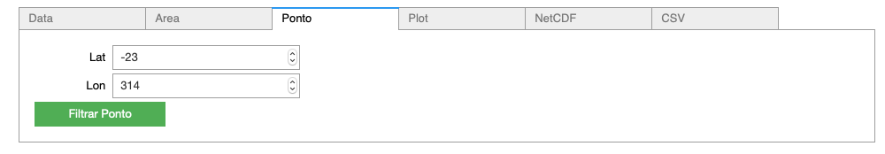
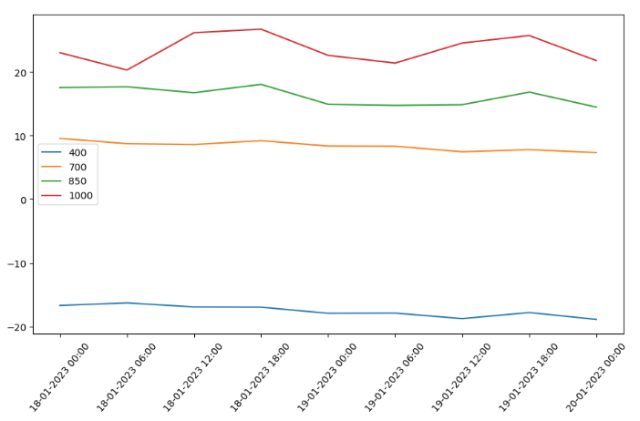
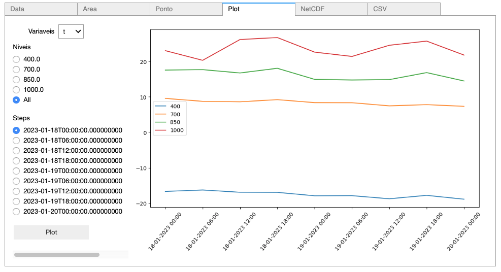

Exemplos Jupyter Notebook
=========================

Instalar biblioteca 

.. code-block:: console

  pip install jupyter

.. warning::
  Alterar a data para os valores exibidos na inicialização
  
.. note::

  **Definição de Steps**
  
  steps = **<int>**
  
  Define o número de steps que serão pedidos
  
  Ex. steps = ``6``
  
  O pedido será os steps ``0,1,2,3,4,5,6``
  
  steps = **<list>**
  
  Define os steps que serão pedidos
  
  Ex. steps =  ``[0,2,4,6]``
  
  O pedido será os steps específicos pedidos ``0,2,4,6``
  
Example_lib
-----------

Este exemplo demonstra varios usos da biblioteca, tais como:

- recuoeracao de dados com filtros (data, variaveis, niveis e step) 
- filtro de area
- plotar campo
- salvar NetCDF

|pic11| - |pic12| - |pic13|

.. |pic11| image:: _static/ex_1_1.png
   :width: 30%

.. |pic12| image:: _static/ex_1_2.png
   :width: 30%
   
.. |pic13| image:: _static/ex_1_3.png
   :width: 30%
   
Download :download:`Example_lib.ipynb <examples/Example_lib.ipynb>`.

Example_lib_regrid
------------------

Utilização da biblioteca UTIL para realizar o Regrid para colocar os modelos na mesma grade.

|pic21| - |pic22| 

.. |pic21| image:: _static/ex_2_1.png
   :width: 45%

.. |pic22| image:: _static/ex_2_2.png
   :width: 45%

Download :download:`Example_lib_regrid.ipynb <examples/Example_lib_regrid.ipynb>`.

Example_lib_Widgets
-------------------

Utilizando Widgets para o desenvolvimento de uma Interface para:
- recuperação de dados
- filtagem de área ou ponto
- plotagem de área ou ponto
- exportar em NetCDF ou CSV

**Janela de Recuperação de Dados**

.. note::

  Escolher data, campo/campos, nível/nîveis e o número de steps do Modelo Numérico.

.. warning::

  O maior número de escolhas afeta o tempo de espera do pedido.
  
  
.. image:: _static/pedido.png
   :width: 70%

**Janela filtro Área**

|pic31| - |pic32| 

.. |pic31| image:: _static/ex_3_1.png
   :width: 45%

**Janela filtro Ponto**

|pic33| - |pic34| 

**Janela Plot**

|pic35| - |pic36| 

.. |pic35| image:: _static/ex_3_5.png
   :width: 45%

**Export NetCDF/CSV**

|pic37| - |pic38| 

.. |pic37| image:: _static/ex_3_7.png
   :width: 45%

.. note::

  O arquivo NetCDF ou CSV é gerado no diretório corrente do .ipynb com o nome de output

Download :download:`Example_lib_Widgets.ipynb <examples/Example_lib_Widgets.ipynb>`.

