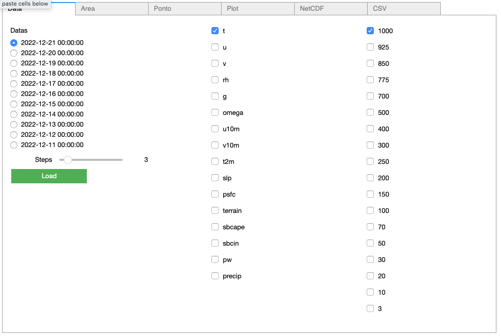

Exemplos Jupyter Notebook
=========================

Instalar biblioteca 

.. code-block:: console

  pip install jupyter

Example_lib
-----------

Este exemplo demonstra varios usos da biblioteca, tais como:

- recuoeracao de dados com filtros (data, variaveis, niveis e step) 
- filtro de area
- plotar campo
- salvar NetCDF

|pic11| - |pic12| - |pic13|

.. |pic11| image:: _static/ex_1_1.png
   :width: 30%

.. |pic12| image:: _static/ex_1_2.png
   :width: 30%
   

   
Download :download:`Example_lib.ipynb <examples/Example_lib.ipynb>`.

Example_lib_regrid
------------------

Utilização da biblioteca UTIL para realizar o Regrid para colocar os modelos na mesma grade.

|pic21| - |pic22| 

.. |pic21| image:: _static/ex_2_1.png
   :width: 45%

Download :download:`Example_lib_regrid.ipynb <examples/Example_lib_regrid.ipynb>`.

Example_lib_Widgets
-------------------

Utilizando Widgets para o desenvolvimento de uma Interface para:
- recuperação de dados
- filtagem de área ou ponto
- plotagem de área ou ponto
- exportar em NetCDF ou CSV

Janela de Recuperação de Dados - Escolher a data desejada, o campo, os nîveis e os steps do Modelo Numérico.

